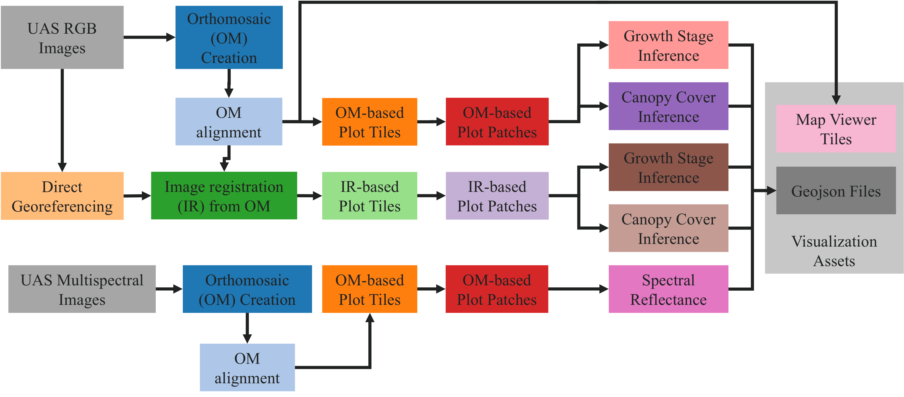

# UAS Orchestration Engine

This project provides an open-source orchestration engine designed to automate and scale the transformation of raw Unmanned Aerial Systems (UAS) imagery into structured, AI-ready datasets for agricultural research. 

### Tags: 
- Digital-Agriculture

### License
- [](https://opensource.org/licenses/MIT)
  
## References

### Related Resources

**Paper:** An Orchestration Engine for Scalable, On-Demand AI Phenotyping from UAS Imagery in Agriculture
Lucas Waltz (The Ohio State University), Sarikaa Sridhar (The Ohio State University), Ryan Waltz (The Ohio State University), Paul Rodriguez (University of California, San Diego), Chaeun Hong (The Ohio State University), Armeen Ghoorkhanian (The Ohio State University), Nicole DiMarco (The Ohio State University) Raghu Machiraju (The Ohio State University), and Sami Khanal (The Ohio State University). Proceedings of the 33rd ACM SIGSPATIAL International Conference on Advances in Geographic Information Systems (SIGSPATIAL '25)

**Project Website:** https://go.osu.edu/aerialagriviewer_sigspatial2025

**Live Demo:** https://go.osu.edu/aerialagriviewer_sigspatial2025

**Demo Dataset:** https://app.globus.org/file-manager?origin_id=87b3fbdc-2d9d-4fad-93ca-e3828ae2f37d&origin_path=%2F

*Note: The demo dataset includes a 2025_poc/stashed/ folder containing reference outputs from the orchestration engine. You can use these outputs to validate your pipeline results when running the orchestration engine*

## Acknowledgements
  
*National Science Foundation (NSF) funded AI institute for Intelligent Cyberinfrastructure with Computational Learning in the Environment (ICICLE) (OAC 2112606)*

## Issue reporting

Contact:

For questions or support:

Luke Waltz: waltz.12@osu.edu

---

# Tutorials

### Overview

This project provides an open-source orchestration engine designed to automate and scale the transformation of raw Unmanned Aerial Systems (UAS) imagery into structured, AI-ready datasets for agricultural research. The pipeline supports both High-Performance Computing (HPC) environments using SLURM and cloud platforms like Google Cloud Platform (GCP) Batch, enabling flexible deployment for different research needs.

The engine addresses the critical bottleneck of data processing for researchers, enabling them to move from raw aerial images to actionable, AI-driven phenotypic insights with minimal manual intervention.

### Prerequisites

**For SLURM/HPC Deployment:**
- HPC cluster with SLURM workload manager
- Singularity/Apptainer for container execution
- Conda for environment management

**For GCP Deployment:**
- Google Cloud Platform account with Batch API enabled
- `gcloud` CLI configured
- Docker for building container images
- `rclone` configured for Google Cloud Storage

**For Both:**
- Python 3.9+
- Sufficient storage for imagery and processing outputs

### Pipeline Steps

The orchestration engine supports the following processing steps:

### Orthomosaic-Based Workflow (SLURM & GCP)
1. **step1**: Orthomosaic generation using OpenDroneMap (RGB and multispectral)
2. **step2**: Orthomosaic alignment across time points using template matching
3. **step3**: Plot tile extraction from aligned orthomosaics
7. **step7**: Plot tile to patch conversion for AI models
9. **step9**: Growth stage inference (Vision Transformer model)
10. **step10**: Canopy cover inference (K-means clustering)
11. **step11**: Spectral reflectance inference (Random Forest)
14. **step14**: GeoJSON generation with phenotypic attributes
15. **step15**: Map tile generation for web visualization

### Direct Georeferencing Workflow (SLURM Only)
4. **step4**: Direct georeferencing (DGR) of individual images
5. **step5**: Image registration (IR) for temporal alignment
6. **step6**: Plot tile extraction from registered images
8. **step8**: Plot tile to patch conversion for AI models (DGR/IR pathway)
12. **step12**: Growth stage inference from DGR/IR pathway
13. **step13**: Canopy cover and spectral inference from DGR/IR pathway

Each step can be run independently or as part of a complete workflow pipeline. Steps can depend on outputs from previous steps (e.g., step2 requires step1, step9 requires step7).


---

# How-To Guides

### Problem Description:

This project provides an open-source orchestration engine designed to automate and scale the transformation of raw Unmanned Aerial Systems (UAS) imagery into structured, AI-ready datasets for agricultural research. The pipeline supports both High-Performance Computing (HPC) environments using SLURM and cloud platforms like Google Cloud Platform (GCP) Batch, enabling flexible deployment for different research needs.

The engine addresses the critical bottleneck of data processing for researchers, enabling them to move from raw aerial images to actionable, AI-driven phenotypic insights with minimal manual intervention.

### Getting Started

## Installation:

1. **Clone the repository:**
   ```bash
   git clone https://github.com/yourusername/uas_orchestration.git
   cd uas_orchestration
   ```

2. **Create the conda environment:**
   ```bash
   # For local development/SLURM
   conda env create -f environment_local.yml
   conda activate harvest

   # For Docker containers
   conda env create -f environment_docker.yml
   ```

3. **Configure rclone for cloud storage (GCP only):**
   ```bash
   rclone config
   # Set up Google Cloud Storage remote named 'gcs'
   ```

### Configuration

1. **Create a YAML configuration file** based on your deployment platform:
   - For SLURM: Use `yaml/uas_config.yaml` as a template
   - For GCP: Use `yaml/uas_config_gcp.yaml` as a template

2. **Key configuration sections:**
   ```yaml
   platform: 'gcp'  # or 'slurm'
   base_folder: ':gcs:data-uas/2025_poc/'  # Storage location

   flight_list:     # Define your fields and flights
     field_name:
       orthomosaic_name: []  # Empty list or boundary shapefile path

   plot_shapefiles: # Shapefile locations for plot boundaries
     field_name:
       crop_type: 'path/to/shapefile.shp'

   shapefiles_alignment_folder: 'shapefiles/alignment/'  # Required for step2
   shapefiles_alignment_format: '{om}_pts/{om}_pts.shp'

   uas_pipeline:    # Configure each processing step
     step1:
       resources:
         cpus: 16
         memory: 120
         machine_type: 'n2-highmem-16'  # GCP only
   ```

3. **Prepare required shapefiles:**
   - **Plot boundary shapefiles** (required): Define individual plot boundaries for each field and crop type
   - **Alignment point shapefiles** (required for step2): Control points for temporal registration of orthomosaics
   - **Boundary polygon shapefiles** (optional): Only needed when a single field contains multiple orthomosaics that need to be separated

### Docker Container Setup (GCP/Cloud)

1. **Build the worker container:**
   ```bash
   docker build -t us-central1-docker.pkg.dev/your-project/orchestration-images/uas-worker:latest .
   ```

2. **Push to container registry:**
   ```bash
   docker push us-central1-docker.pkg.dev/your-project/orchestration-images/uas-worker:latest
   ```

3. **Build the ODM container:**
   ```bash
   docker build -f Dockerfile.odm -t us-central1-docker.pkg.dev/your-project/orchestration-images/odm:latest .
   docker push us-central1-docker.pkg.dev/your-project/orchestration-images/odm:latest
   ```

## Usage

### Running on SLURM

1. **Initialize the environment:**
   ```bash
   source ~/miniconda3/etc/profile.d/conda.sh
   conda activate harvest
   ```

2. **Test individual steps:**
   ```bash
   cd execution
   python orchestrate.py \
       --config_file ../yaml/uas_config.yaml \
       --platform slurm \
       --steps step1 step2 \
       --dry_run
   ```

3. **Run the orthomosaic-based pipeline:**
   ```bash
   python orchestrate.py \
       --config_file ../yaml/uas_config.yaml \
       --platform slurm \
       --steps step1 step2 step3 step7 step9 step10 step11 step14 step15
   ```

4. **Run the direct georeferencing pipeline:**
   ```bash
   python orchestrate.py \
       --config_file ../yaml/uas_config.yaml \
       --platform slurm \
       --steps step4 step5 step6 step8 step12 step13 step14 step15
   ```

5. **Enable continuous processing (folder watcher):**
   ```bash
   # Edit orchestrate_ondemand.sh with your configuration
   sbatch orchestrate_ondemand.sh
   ```

### Running on GCP Batch

1. **Configure GCP credentials:**
   ```bash
   gcloud auth login
   gcloud config set project your-project-id
   ```

2. **Run the orchestration:**
   ```bash
   cd execution
   python orchestrate.py \
       --config_file ../yaml/uas_config_gcp.yaml \
       --platform gcp \
       --steps step1 step2 step3 step7 step9 step10 step11 step14 step15
   ```

   *Note: Direct georeferencing steps (4, 5, 6, 8, 12, 13) are currently only supported on SLURM*

3. **Monitor job status:**
   ```bash
   # View generated job tracking
   python ../utils/displayjson_jobid.py \
       --json_file ../profiling/job_id.json \
       --output_html_file ../profiling/report_job_status.html

   # Open the HTML report in a browser
   ```

## AI Models

The demo dataset listed at the beginning of this readme includes pre-trained models for:

- **Growth Stage Classification** (`models/growth_stage/`): Vision Transformer model for corn growth stage prediction
- **Canopy Cover Estimation** (`models/canopy_coverage/`): K-means clustering model for canopy coverage
- **Spectral Reflectance** (`models/spectral_reflectance/`): Random Forest model for NDVI and spectral indices

Models are automatically loaded by the inference scripts.

## Monitoring and Profiling

The orchestration engine provides built-in monitoring:

- **Job Status Tracking**: Documentation of pipeline execution status (`profiling/job_id.json`)
- **Flight Processing Status**: Track which flights have completed which steps (`profiling/flight_dict.json`)
- **Performance Logging**: Execution time and resource usage metrics (`processing/logs_perf/`)
- **HTML Reports**: Auto-generated status dashboards (`utils/displayjson_*.py`)

## Troubleshooting

### Common Issues

1. **"Config file not found"**: Ensure the `--config_file` path is correct and the YAML is valid
2. **"Model not found"**: Check that model files exist in `models/` directory or are embedded in Docker container
3. **GCP authentication errors**: Run `gcloud auth application-default login`
4. **Memory errors**: Increase memory allocation in config `resources.memory` section
5. **Storage path errors**: For GCP, ensure paths use `:gcs:` prefix; for SLURM, use absolute paths
6. **Missing alignment points**: Ensure alignment point shapefiles exist for step2 temporal registration

### Validation

Each step includes validation to check if outputs were created successfully. Check logs in:
- SLURM: `processing/logs_*/`
- GCP: Google Cloud Console → Batch → Jobs → Logs

---

# Explanation

### Background:

UAS Imagery is increasingly being used by farmers and agricultural researchers. While farmers commonly rely on commercial scouting services that have their own proprietary pipelines, these are unavailable to agricultural researchers who are looking to create novel approaches to weed detection, nutrient management, and plant disease utilizing AI phenotyping. In our case, a UAS pilot was able to conduct more than 400 flights across a total of 700 fields in the summer of 2025 across small-plot and on-farm research fields, generating nearly 4 TB of imagery utilizing both  RGB and multispectral sensors. Our workflow for generating AI phenotypes of canopy cover, spectral reflectance, and growth stage included 15 unique Python scripts. To process these manually would have involved thousands of unique interdependent jobs. We created a UAS orchestration engine to solve our problem of processing many terabytes of aerial imagery and running thousands of jobs using a directed acyclic graph (DAG) approach which maximizes parallel processing capability. While originally developed for SLURM HPC, it also contains an implementation for Google Cloud Platform and could be extended to other cloud platforms as needed. The UAS Orchestration Engine was built by researchers for researchers. It is open-source and modular, so that researchers can use many of the common building blocks such as orthomosaic creation and plot tile image extraction while adding steps that are unique to their own use case. 

### Key Features:

- **Multi-Platform Support**: Run on HPC clusters (SLURM) or cloud platforms (GCP Batch, with AWS/Azure support in development)
- **Scalable Architecture**: Process hundreds or thousands of flights in parallel using containerized workflows
- **On-Demand Processing**: Folder-watching capability automatically initiates processing as new imagery arrives
- **Modular Pipeline**: 15+ configurable processing steps from raw imagery to AI inference and visualization
- **Dual Georeferencing Pathways**: Supports both orthomosaic-based workflow and direct georeferencing with image registration
- **Automated Orthomosaic Generation**: Integration with OpenDroneMap for creating georeferenced mosaics
- **Temporal Alignment**: Automatic registration of multi-temporal imagery for consistent AI training datasets
- **AI Phenotyping**: Inference modules for crop growth stage, canopy cover, and spectral reflectance
- **GeoJSON Generation**: Automated creation of plot-level phenotypic data for visualization
- **Web-based Visualization**: Map tile generation for interactive web viewers
- **Docker Containerization**: Consistent execution environments across platforms

<figure>
  
  <figcaption>The data processing workflow of the orchestration engine, from raw imagery to visualization assets.</figcaption>
</figure>

